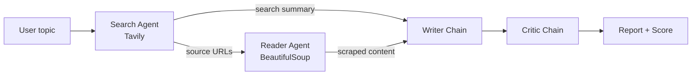

# 🔎 ResearchMind: Multi-Agent Research System

ResearchMind is a multi-agent AI system that turns any topic into a sourced research report. Four components work in sequence: a **Search Agent** finds sources, a **Reader Agent** scrapes them, a **Writer Chain** drafts the report, and a **Critic Chain** reviews and scores it. It runs from the terminal or through a Streamlit web UI.

---

## 📸 Output Screenshots

<table>
  <tr>
    <td align="center"><b>1. Home screen</b><br></td>
    <td align="center"><b>2. Pipeline running</b><br></td>
  </tr>
  <tr>
    <td align="center"><b>3. Search results</b><br></td>
    <td align="center"><b>4. Scraped content</b><br></td>
  </tr>
  <tr>
    <td align="center"><b>5. Final report</b><br></td>
    <td align="center"><b>6. Critic feedback and score</b><br></td>
  </tr>
</table>

---

## ✨ Features

- **Four-stage pipeline:** search, scrape, write and critique, each handled by a dedicated component.
- **Tool-calling agents** built with LangChain's `create_agent`, connected to two custom tools.
- **LCEL chains** (`prompt | llm | StrOutputParser`) for the writer and critic stages.
- **Cited reports** with Introduction, Key Findings, Conclusion, Limitations and Sources sections.
- **Automated critic** that gives a score out of 10, strengths, areas to improve and a one-line verdict.
- **Streamlit UI** with live status cards for each pipeline step and a downloadable report.
- **Flexible LLM setup:** works with Groq or Google Gemini.

---

## 🏗️ Architecture



| Stage | Type | Tool | Job |
|---|---|---|---|
| Search Agent | Agent | Tavily | Finds recent web sources and returns titles, URLs and snippets |
| Reader Agent | Agent | BeautifulSoup | Scrapes the top URLs for deeper page content |
| Writer Chain | LCEL chain | none | Drafts a structured, cited report from the gathered research |
| Critic Chain | LCEL chain | none | Reviews the report and returns a score with feedback |

---

## 🧰 Tech Stack

- **Language:** Python 3.10+
- **Framework:** LangChain, LangGraph, LCEL Runnables
- **LLMs:** Groq API, Google Gemini API
- **Tools:** Tavily Search API, BeautifulSoup and Requests
- **UI:** Streamlit

---

## 📁 Project Structure

```
multi_agent_system/
├── agents.py          # LLM setup, search/reader agents, writer and critic chains
├── tools.py           # Tavily search tool and BeautifulSoup scraper tool
├── pipeline.py        # Runs the full pipeline in the terminal
├── app.py             # Streamlit UI
├── groq_models_list.py # Lists the Groq models available to your API key
├── requirements.txt   # Python dependencies
├── .env.example       # Template for API keys
├── .gitignore
├── Output SS/         # Screenshots used in this README
└── README.md
```

---

## 🚀 Getting Started

### 1. Clone the repository

```bash
git clone https://github.com/YOUR_USERNAME/YOUR_REPO_NAME.git
cd YOUR_REPO_NAME
```

### 2. Create and activate a virtual environment

```bash
python -m venv venv

# Windows
venv\Scripts\activate

# macOS / Linux
source venv/bin/activate
```

### 3. Install dependencies

```bash
pip install -r requirements.txt
```

### 4. Add your API keys

Copy `.env.example` to `.env` and fill in your keys:

```
GROQ_API_KEY=your_groq_key_here
TAVILY_API_KEY=your_tavily_key_here
GOOGLE_API_KEY=your_gemini_key_here
```

| Key | Where to get it | Required |
|---|---|---|
| `TAVILY_API_KEY` | [tavily.com](https://tavily.com) | Yes |
| `GROQ_API_KEY` | [console.groq.com](https://console.groq.com) | If you use Groq |
| `GOOGLE_API_KEY` | [aistudio.google.com](https://aistudio.google.com) | If you use Gemini |

> ⚠️ Never commit your `.env` file. It is already listed in `.gitignore`.

---

## ▶️ Usage

### Run the Streamlit UI

```bash
streamlit run app.py
```

Enter a topic (for example *"Impact of war on the stock market"*) and click **Run Research Pipeline**. The status cards update as each step runs, and the report, critic feedback, search results, scraped content and sources appear in tabs below.

### Run in the terminal

```bash
python pipeline.py
```

---

## ⚙️ Configuration

Model settings live in `agents.py`.

**Switch the main model (Groq or Gemini):**

```python
from langchain_groq import ChatGroq
llm = ChatGroq(model="your-groq-model-id", temperature=0, max_retries=2)
```

Model IDs change over time. To see which models your Groq key can use, run:

```bash
python groq_models_list.py
```

Copy a model ID from the output into `agents.py`. Pick one that supports **tool calling**, because the search and reader agents depend on it.

**Tune scraping size** in `tools.py`: `MAX_RESULTS`, `SNIPPET_CHARS` and `SCRAPE_CHARS` control how much text goes to the LLM. Lower them if you hit token limits.

---

## 🛠️ Troubleshooting

| Problem | Likely cause and fix |
|---|---|
| `429 RESOURCE_EXHAUSTED` or rate-limit error | Free-tier quota reached. Wait for the reset, switch provider, or lower `SCRAPE_CHARS`. |
| `model_not_found` (404) | The model ID is retired or unavailable to your key. Run `python groq_models_list.py` and use a current ID. |
| Reader agent returns nothing | The search step found no URLs, or the site blocks scrapers. Try another topic or increase the number of URLs scraped. |
| Empty report | Usually a model or token-limit issue. Reduce `SCRAPE_CHARS` or switch models. |
| Scraper fails on some sites | Some sites (news, paywalled) block plain HTTP requests or need JavaScript. This is expected. |